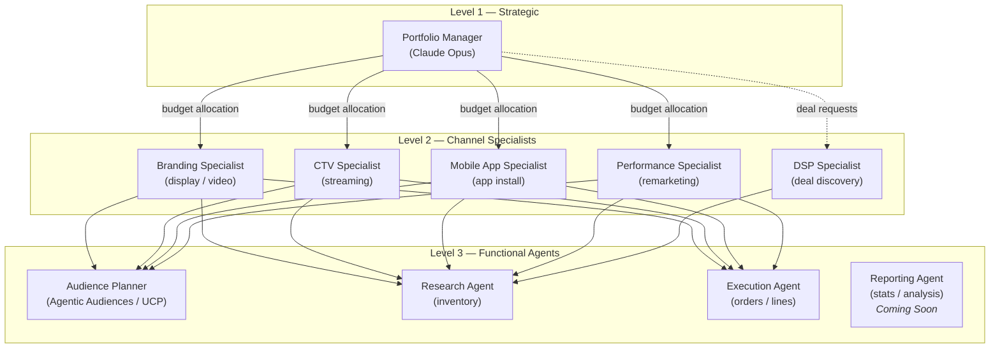
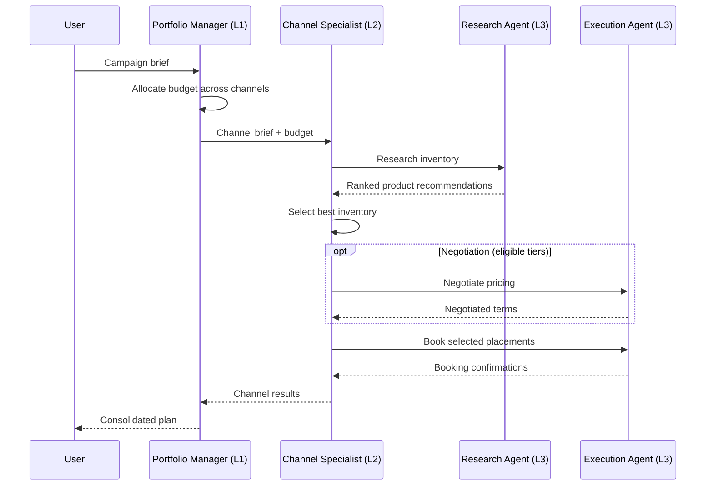

# Agent Hierarchy

The buyer agent uses a three-level agent hierarchy powered by [CrewAI](https://www.crewai.com/). Each level has a distinct responsibility: strategic orchestration, channel-specific expertise, and functional execution.

Three levels exist because advertising campaigns require decisions at three different scopes. A single agent cannot efficiently reason about both portfolio-wide budget strategy and the mechanics of reserving a line item --- the context windows, LLM costs, and failure modes are fundamentally different at each scope. By separating strategic reasoning (Level 1) from channel expertise (Level 2) and task execution (Level 3), the system keeps each agent focused on a narrow responsibility, reduces per-call token cost by using smaller models where appropriate, and allows channel specialists to run in parallel without blocking the portfolio-level plan.

## Overview



---

## Level 1 --- Portfolio Manager

The Portfolio Manager is the top-level orchestrator. It receives a campaign brief and determines how to allocate budget across channels.

**Key file:** `src/ad_buyer/agents/level1/portfolio_manager.py`

| Attribute | Value |
|-----------|-------|
| Role | Portfolio Manager |
| LLM | `anthropic/claude-opus-4-20250514` (configurable via `MANAGER_LLM_MODEL`) |
| Temperature | 0.3 |
| Delegation | Enabled --- delegates to Level 2 agents |
| Memory | Enabled |

**Responsibilities:**

- Analyze campaign briefs and extract objectives, constraints, and KPIs
- Allocate budget across channels (Branding, CTV, Mobile, Performance)
- Provide channel-specific guidance to specialists
- Monitor overall campaign coherence

```python
from ad_buyer.agents.level1.portfolio_manager import create_portfolio_manager

manager = create_portfolio_manager(
    tools=[],       # Tools added by crews
    verbose=True,
)
```

!!! note "LLM Selection"
    The Portfolio Manager uses Opus (the most capable model) because it handles strategic reasoning across the full campaign. Channel specialists use Sonnet for cost-efficient execution of narrower tasks.

---

## Level 2 --- Channel Specialists

Each Level 2 agent owns a specific advertising channel. They receive budget allocations from the Portfolio Manager and coordinate Level 3 agents to research inventory and execute bookings.

**Key directory:** `src/ad_buyer/agents/level2/`

All channel specialists share these defaults:

| Attribute | Value |
|-----------|-------|
| LLM | `anthropic/claude-sonnet-4-5-20250929` (configurable via `DEFAULT_LLM_MODEL`) |
| Temperature | 0.5 |
| Delegation | Enabled --- delegates to Level 3 agents |
| Memory | Enabled |

### Branding Specialist

**File:** `src/ad_buyer/agents/level2/branding_agent.py`

Focuses on premium display and video placements for upper-funnel brand awareness.

| Area | Focus |
|------|-------|
| Formats | Homepage takeovers, roadblocks, premium video (in-stream, outstream) |
| Metrics | Viewability (70%+ target), brand recall, engagement |
| Safety | Brand safety verification, contextual relevance |
| Reach | Cross-device frequency management |

```python
from ad_buyer.agents.level2 import create_branding_agent

agent = create_branding_agent(tools=[...])
```

### CTV Specialist

**File:** `src/ad_buyer/agents/level2/ctv_agent.py`

Expert in Connected TV and streaming inventory.

| Area | Focus |
|------|-------|
| Platforms | Roku, Fire TV, Apple TV, Samsung TV+ |
| Content | Hulu, Peacock, Paramount+, Max, FAST channels (Pluto, Tubi) |
| Targeting | Household-level, device graphs, cross-screen frequency |
| Standards | VAST/VPAID creative specs, addressable TV |

### Mobile App Specialist

**File:** `src/ad_buyer/agents/level2/mobile_app_agent.py`

Drives efficient app installs and post-install conversions.

| Area | Focus |
|------|-------|
| Attribution | MMP integrations (AppsFlyer, Adjust, Branch, Kochava) |
| Formats | Rewarded video, interstitials, mobile web |
| Fraud | Click injection detection, install farm prevention |
| Privacy | SKAdNetwork, attribution windows |

### Performance Specialist

**File:** `src/ad_buyer/agents/level2/performance_agent.py`

Maximizes conversions and ROAS through lower-funnel tactics.

| Area | Focus |
|------|-------|
| Strategies | Retargeting, remarketing, lookalike modeling |
| Optimization | CPA/ROAS targets, bid optimization, pacing |
| Creative | Dynamic creative optimization, A/B testing |
| Tracking | Pixel implementation, cross-device attribution |

### DSP Deal Discovery Specialist

**File:** `src/ad_buyer/agents/level2/dsp_agent.py`

Discovers inventory and obtains Deal IDs for activation in traditional DSP platforms.

| Area | Focus |
|------|-------|
| Platforms | The Trade Desk, DV360, Amazon DSP, Xandr, Yahoo DSP |
| Deal types | PG (guaranteed), PD (preferred), PA (private auction) |
| Pricing | Identity-based tiered pricing, volume discounts |
| Negotiation | Price negotiation for agency/advertiser tiers |

!!! tip "DSP vs. other specialists"
    The DSP Specialist works alongside the channel specialists, not in place of them. Channel specialists decide *what* inventory to buy; the DSP Specialist handles the mechanics of obtaining Deal IDs for programmatic activation. See [DSP Deal Flow](dsp-deal-flow.md) for the full workflow.

---

## Level 3 --- Functional Agents

Level 3 agents are shared across channels. They do not make strategic decisions --- they execute specific functions on behalf of the Level 2 specialists.

**Key directory:** `src/ad_buyer/agents/level3/`

All functional agents share these defaults:

| Attribute | Value |
|-----------|-------|
| LLM | `anthropic/claude-sonnet-4-5-20250929` |
| Delegation | Disabled --- they are leaf-level executors |
| Memory | Enabled |

### Audience Planner (Agentic Audiences / UCP)

**File:** `src/ad_buyer/agents/level3/audience_planner_agent.py`

The Audience Planner composes audience targets for a campaign by selecting and arranging references across three IAB-standardized audience types. It is the only agent in the buyer that owns the audience surface end-to-end --- from brief ingestion through the deal request that goes to sellers.

!!! note "Naming: Agentic Audiences (UCP)"
    The IAB renamed *User Context Protocol (UCP)* to *Agentic Audiences* in early 2026; the spec is still DRAFT. Code keeps the existing `ucp_*` module names internally to avoid a churning rename, but the public surface (docs, error messages, log identifiers) uses the dual form **"Agentic Audiences (UCP)"** so readers familiar with either name can follow. See `docs/architecture/naming.md` in the agent_range parent repo for the locked decision and rationale.

#### The three audience types

| Type | Source | Format | Best for |
|------|--------|--------|----------|
| **Standard** | IAB Audience Taxonomy 1.1 | Tier-1 (Demographic / Interest-based / Purchase-intent) IDs | Portable third-party-aligned segments |
| **Contextual** | IAB Content Taxonomy 3.1 | ~1,500 hierarchical category IDs | Privacy-resilient adjacency targeting |
| **Agentic** | IAB Agentic Audiences (DRAFT, 2026-01) | 256--1024 dim signal embeddings | Advertiser first-party signal, lookalikes, dynamic audiences |

Taxonomies are vendored at `data/taxonomies/` with version + sha256 + `fetched_at` tracked in `taxonomies.lock.json`. License attribution per IAB CC-BY 3.0 / 4.0 is preserved alongside each taxonomy file.

#### Composable overlay model

A campaign carries one **primary** audience and zero or more **constraint**, **extension**, or **exclusion** audiences. Each is an `AudienceRef` carrying its type, taxonomy, version, and identifier (or embedding URI for agentic refs).

```text
AudiencePlan
  primary:     AudienceRef(type=standard,   id="3-7",        version="1.1")
  constraints: [AudienceRef(type=contextual, id="IAB1-2",     version="3.1")]
  extensions:  [AudienceRef(type=agentic,    ref="emb://...", version="draft-2026-01")]
  exclusions:  []
```

| Role | Set semantics |
|------|---------------|
| `primary` | base audience (exactly one) |
| `constraints` | intersect with primary (precision) |
| `extensions` | union with primary (reach) |
| `exclusions` | set-difference from the assembled set |

The planner mixes types freely --- a Standard primary narrowed by a Contextual constraint and broadened by an Agentic extension is the canonical shape.

#### Reasoning loop

| Phase | Action |
|-------|--------|
| Classify intent | Resolve `target_audience` strings against vendored taxonomies |
| Pick primary | Standard for demographic/intent briefs; Contextual for content-adjacent; Agentic for first-party-driven |
| Add constraints | When KPI is precision (CPA, ROAS) |
| Add extensions | When KPI is reach (impressions, frequency) |
| Validate | Run discovery + coverage tools; reshuffle if projected reach falls short |
| Emit plan | With human-readable rationale |

#### Configuration

| Area | Detail |
|------|--------|
| Temperature | 0.3 (balanced for strategic recommendations) |
| Signals (agentic) | Identity (hashed IDs, device graphs), Contextual (page content, keywords), Reinforcement (feedback loops, conversion data) |
| Embeddings | sentence-transformers `all-MiniLM-L6-v2` (384-dim) for local; advertiser-supplied vectors accepted verbatim (256--1024 dim); mock SHA256-seeded fallback for CI. Mode controlled by `EMBEDDING_MODE` env var (default: `hybrid`). |
| Threshold | Per-mode similarity thresholds (E2-4): `mock` strong≥0.85; `local`/`advertiser`/`hybrid` strong≥0.70. Re-derive via `ad_buyer.eval.evaluate_embedding_modes()` when the model swaps. |
| Wire format | `application/vnd.ucp.embedding+json; v=1` (alias: `application/vnd.iab.agentic-audiences+json; v=1`) |

#### Tools

- `TaxonomyLookupTool` --- resolve a string against vendored Standard / Contextual taxonomies (no network)
- `AudienceDiscoveryTool` --- query sellers for available segments matching a ref
- `AudienceMatchingTool` --- score a candidate `AudienceRef` against seller capabilities
- `CoverageEstimationTool` --- project unique reach for a composed plan
- `EmbeddingMintTool` --- mint or reference an Agentic embedding. Honors `EMBEDDING_MODE` (`mock` | `local` | `advertiser` | `hybrid`) per the [Embedding Strategy](../../../../docs/decisions/EMBEDDING_STRATEGY_2026-04-25.md) decision in the agent_range parent repo.

#### Embedding provenance

Every agentic `AudienceRef` carries `compliance_context.embedding_provenance` so downstream consumers know where the bytes came from:

- `local_buyer` --- buyer's local sentence-transformers model
- `advertiser_supplied` --- advertiser provided the vector verbatim
- `hosted_external` --- third-party hosted embedding service (not enabled by default)
- `mock` --- deterministic SHA256-seeded fallback for CI / demos

This is the forensic anchor for cross-repo wire correlation and unblocks future privacy-regime fan-out (see the consent surface review at `docs/reports/CONSENT_SURFACE_REVIEW_2026-04-25.md` in the agent_range parent repo).

#### Where the plan goes

The `AudiencePlan` rides on `CampaignPlan` and propagates into `InventoryRequirements`, `DealParams`, `QuoteRequest`, and `DealBookingRequest`. Sellers receive the full plan and evaluate each ref against their package capabilities --- see the seller media-kit docs for how packages declare which audience types they support, and `docs/architecture/capability-negotiation.md` in the agent_range parent repo for the pre-flight + structured-rejection contract.

!!! tip "Wire-format spec"
    The canonical on-the-wire shape of `AudiencePlan` and `AudienceRef` lives in `docs/api/audience_plan_wire_format.md` at the agent_range parent repo. That doc is the single source of truth for buyer↔seller integration; this page describes the agent that produces the plan.

### Research Agent

**File:** `src/ad_buyer/agents/level3/research_agent.py`

Discovers and evaluates advertising inventory across publishers.

| Area | Detail |
|------|--------|
| Temperature | 0.2 (low creativity, high precision for data analysis) |
| Focus | Product search, availability checks, pricing evaluation, publisher comparison |

**Tools used:** `ProductSearchTool`, `AvailsCheckTool`

### Execution Agent

**File:** `src/ad_buyer/agents/level3/execution_agent.py`

Handles the [OpenDirect](https://iabtechlab.com/standards/opendirect/) booking lifecycle.

| Area | Detail |
|------|--------|
| Temperature | 0.1 (minimal creativity, precision execution) |
| Workflow | Draft --> PendingReservation --> Reserved --> PendingBooking --> Booked --> InFlight --> Finished |

**Tools used:** `CreateOrderTool`, `CreateLineTool`, `ReserveLineTool`, `BookLineTool`

### Reporting Agent

!!! info "Coming Soon"
    The Reporting Agent (buyer-brn) is planned for a future phase. This section describes the planned reporting functionality.

**File:** `src/ad_buyer/agents/level3/reporting_agent.py`

Retrieves and analyzes campaign performance data.

| Area | Detail |
|------|--------|
| Temperature | 0.2 (analytical, data-focused) |
| Metrics | Impressions, CPM, CTR, VCR, viewability, pacing, spend |

**Tools used:** `GetStatsTool`

---

## Crew Coordination

Agents are organized into **crews** --- CrewAI constructs that define which agents work together, what tasks they perform, and how authority flows.

### Portfolio Crew

**File:** `src/ad_buyer/crews/portfolio_crew.py`

The top-level crew uses a **hierarchical process** with the Portfolio Manager as the manager agent.

```python
from ad_buyer.crews.portfolio_crew import create_portfolio_crew

crew = create_portfolio_crew(
    client=opendirect_client,
    campaign_brief={
        "name": "Q3 Awareness Campaign",
        "objectives": ["brand_awareness", "reach"],
        "budget": 500_000,
        "start_date": "2026-07-01",
        "end_date": "2026-09-30",
        "target_audience": {"age": "25-54", "interests": ["sports", "news"]},
        "kpis": {"viewability": 0.70, "reach": 2_000_000},
    },
)

result = crew.kickoff()
```

**Structure:**

| Role | Agent | Process |
|------|-------|---------|
| Manager | Portfolio Manager (L1) | Hierarchical --- assigns tasks and reviews output |
| Workers | Branding, CTV, Mobile, Performance (L2) | Receive budget allocation and channel guidance |

**Tasks:**

1. **Budget Allocation** --- Analyze the brief, determine optimal channel split
2. **Channel Coordination** --- Provide targeting and quality guidance per channel

### Channel Crews

**File:** `src/ad_buyer/crews/channel_crews.py`

Each channel has its own crew. The channel specialist acts as the manager, with Research and Execution agents as workers.

```python
from ad_buyer.crews.channel_crews import create_branding_crew

crew = create_branding_crew(
    client=opendirect_client,
    channel_brief={
        "budget": 150_000,
        "start_date": "2026-07-01",
        "end_date": "2026-09-30",
        "target_audience": {"age": "25-54"},
        "objectives": ["brand_awareness"],
    },
    audience_plan={
        "target_demographics": {"age": "25-54", "gender": "all"},
        "target_interests": ["sports", "news", "entertainment"],
    },
)

result = crew.kickoff()
```

Four channel crew factory functions are available:

| Function | Manager Agent | Workers |
|----------|---------------|---------|
| `create_branding_crew()` | Branding Specialist | Research + Execution |
| `create_ctv_crew()` | CTV Specialist | Research + Execution |
| `create_mobile_crew()` | Mobile App Specialist | Research + Execution |
| `create_performance_crew()` | Performance Specialist | Research + Execution |

All channel crews follow the same two-task pattern:

1. **Research Task** --- The Research Agent searches inventory matching the channel brief and audience plan, using both research and audience tools
2. **Recommendation Task** --- The channel specialist reviews findings and selects the best inventory

!!! info "Audience context"
    Channel crews accept an optional `audience_plan` parameter. When provided, the Research Agent incorporates Agentic-Audiences-compatible audience targeting (a typed `AudiencePlan` carrying Standard / Contextual / Agentic refs) into its inventory search. This plan typically comes from the Audience Planner agent.

---

## Execution Flow

A typical end-to-end campaign follows this pattern:



---

## Related

- [Architecture Overview](overview.md) --- Full system architecture
- [Tools Reference](tools.md) --- All CrewAI tools available to agents
- [DSP Deal Flow](dsp-deal-flow.md) --- DSP-specific deal discovery workflow
- [Booking Flow](booking-flow.md) --- Detailed booking sequence
- [Configuration](../guides/configuration.md) --- LLM and agent settings
