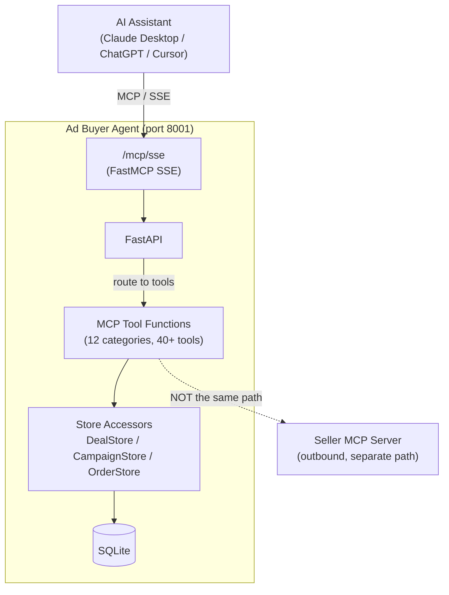

# MCP Server

The buyer agent exposes a FastMCP SSE server that allows AI assistants --- Claude Desktop, ChatGPT, Cursor, Windsurf, and others --- to call buyer operations as structured tools. This is distinct from the buyer's outbound MCP client, which calls seller agents.

!!! info "Two MCP roles"
    The buyer agent is both an **MCP client** (calling sellers via `IABMCPClient`) and an **MCP server** (serving AI assistants via `FastMCP`). These are independent: the client speaks to seller endpoints; the server speaks to AI assistants connected by users.

    | Direction | Component | Purpose |
    |-----------|-----------|---------|
    | Outbound | `IABMCPClient` | Buyer calls seller MCP servers to browse inventory and book deals |
    | Inbound | FastMCP SSE server | AI assistants call the buyer's MCP server to operate the buyer agent |

---

## Mounting

The MCP server is a [FastMCP](https://github.com/jlowin/fastmcp) SSE application mounted on the main FastAPI process:

```
FastAPI (port 8001)
  POST /bookings
  GET  /bookings/{job_id}
  GET  /health
  ...
  MOUNT /mcp/sse  <-- FastMCP SSE app
```

The mount is a single call in `interfaces/api/main.py`:

```python
from ad_buyer.interfaces.mcp_server import mount_mcp
mount_mcp(app)  # Creates /mcp/sse
```

`mount_mcp` calls `mcp.sse_app()` and mounts the resulting ASGI application under `/mcp/sse`. MCP clients connect to `http://<host>:8001/mcp/sse`.

### Auth middleware note

The FastAPI `api_key_auth_middleware` applies to all HTTP paths. The MCP SSE path (`/mcp/sse`) is not in the public path exemption list (`/health`, `/docs`, `/openapi.json`, `/redoc`), so it passes through the key check. When `settings.api_key` is non-empty, MCP clients must send `X-API-Key: <key>` on the initial SSE connection. When `settings.api_key` is empty (default for local development), the middleware skips authentication entirely.

---

## Tool Categories

The server exposes 12 tool categories implemented in `interfaces/mcp_server.py`.

| Category | Bead | Tools | Description |
|----------|------|-------|-------------|
| Foundation | — | `get_setup_status`, `health_check`, `get_config` | System health and configuration |
| Setup Wizard | buyer-byk | `run_setup_wizard`, `get_wizard_step`, `complete_wizard_step`, `skip_wizard_step` | 8-step onboarding wizard |
| Campaign Management | buyer-3w3 | `list_campaigns`, `get_campaign_status`, `check_pacing`, `review_budgets` | Campaign status and budget pacing |
| Deal Library | buyer-4ds | `list_deals`, `search_deals`, `inspect_deal`, `import_deals_csv`, `create_deal_manual`, `get_portfolio_summary` | Deal CRUD and portfolio analytics |
| Seller Discovery | buyer-nob | `discover_sellers`, `get_seller_media_kit`, `compare_sellers` | IAB AAMP registry and seller media kits |
| Negotiation | buyer-r0j | `start_negotiation`, `get_negotiation_status`, `list_active_negotiations` | Price negotiation lifecycle |
| Orders | buyer-r0j | `list_orders`, `get_order_status`, `transition_order` | Order management and state transitions |
| Approvals | buyer-j7f | `list_pending_approvals`, `approve_or_reject` | Approval gate management |
| API Keys | buyer-j7f | `list_api_keys`, `add_api_key`, `remove_api_key`, `test_seller_connection` | Seller API credential management |
| SSP Connectors | buyer-4ds | `list_ssp_connectors`, `sync_ssp_deals`, `test_ssp_connection` | SSP deal import and sync |
| Templates | buyer-4ds | `list_templates`, `create_template`, `instantiate_from_template` | Deal and supply path templates |
| SSP Sync | buyer-4ds | `import_ssp_deals` | Bulk deal import from SSP connectors |

---

## Tool Registration Pattern

All tools are registered on a module-level `FastMCP` instance using the `@mcp.tool()` decorator:

```python
mcp = FastMCP(
    name="ad-buyer-agent",
    instructions="...",
)

@mcp.tool()
def list_deals(status: str | None = None, ...) -> str:
    """List deals in the portfolio..."""
    store = _get_deal_store()
    ...
    return json.dumps(result, indent=2)
```

All tools return JSON strings. The MCP client deserializes them as tool results. Async tools (e.g., `discover_sellers`, `get_seller_media_kit`) use `async def` and are supported by FastMCP's SSE transport.

---

## Store Accessor Pattern

Each tool calls a module-level accessor function rather than using a global store instance. This pattern makes tools testable by injection:

```python
_deal_store_override: DealStore | None = None

def _get_deal_store() -> DealStore:
    if _deal_store_override is not None:
        return _deal_store_override  # Injected by tests
    settings = _get_settings()
    store = DealStore(settings.database_url)
    store.connect()
    return store

def _set_deal_store(store: DealStore | None) -> None:
    global _deal_store_override
    _deal_store_override = store
```

Tests inject an in-memory `DealStore("sqlite:///:memory:")` via `_set_deal_store()`. Production code uses the settings-based singleton. The same pattern applies to `CampaignStore`, `PacingStore`, `OrderStore`, and `ApiKeyStore`.

---

## Architecture Diagram



---

## Related

- [Tools Reference](tools.md) --- CrewAI tools the buyer uses when calling sellers (outbound)
- [Deal Library](deal-library.md) --- Architecture of the deal library surfaced by the Deal Library tool category
- [Deal Store](deal-store.md) --- SQLite persistence layer that MCP tools read and write
- [AI Assistant: Overview](../ai-assistant/overview.md) --- How to connect Claude Desktop or other clients to this server
