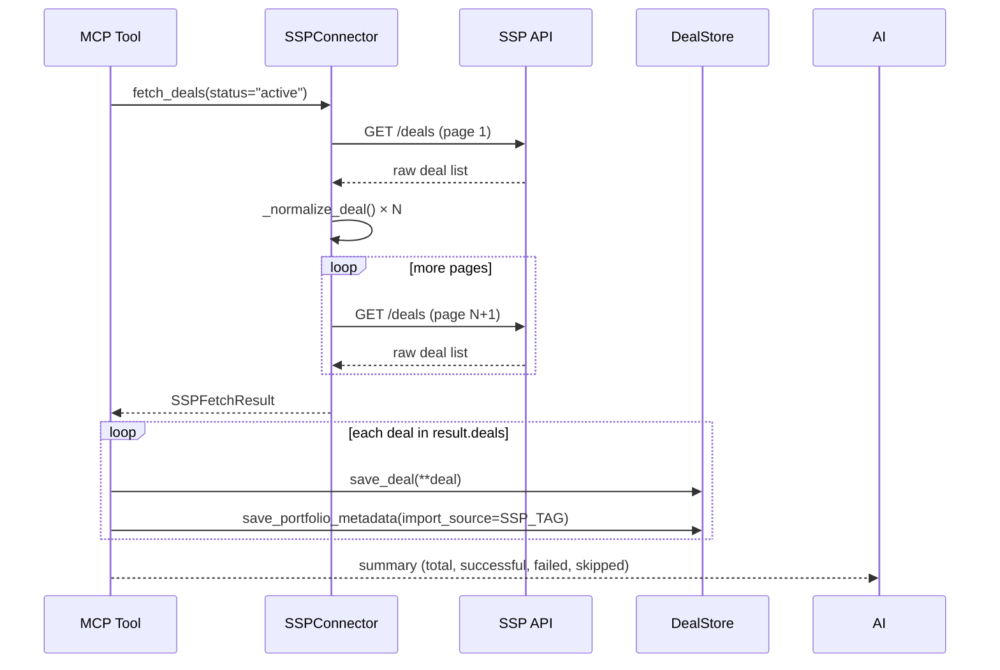

# SSP Connectors

SSP connectors import deals from supply-side platforms directly into the deal library. Each connector speaks its SSP's API format and normalizes deals to `DealStore.save_deal()` kwargs.

Source: `src/ad_buyer/tools/deal_library/connectors/`

---

## Abstract Base Class

All connectors implement the `SSPConnector` abstract base class (`tools/deal_library/ssp_connector_base.py`).

```python
class SSPConnector(ABC):

    @property
    @abstractmethod
    def ssp_name(self) -> str:
        """Human-readable SSP name (e.g. "PubMatic")."""

    @property
    @abstractmethod
    def import_source(self) -> str:
        """Tag written to portfolio_metadata (e.g. "PUBMATIC")."""

    @abstractmethod
    def fetch_deals(self, **kwargs) -> SSPFetchResult:
        """Fetch and normalize deals from the SSP API."""

    @abstractmethod
    def _normalize_deal(self, raw_deal: dict) -> dict:
        """Map one SSP API deal object to DealStore kwargs."""

    def get_required_config(self) -> list[str]:
        """Return required environment variable names."""
        return []

    def is_configured(self) -> bool:
        """True if all required env vars are set and non-empty."""
```

The `SSPFetchResult` dataclass is the standard return type:

| Field | Type | Description |
|-------|------|-------------|
| `deals` | `list[dict]` | Normalized deals ready for `DealStore.save_deal()` |
| `errors` | `list[str]` | Human-readable normalization error messages |
| `total_fetched` | `int` | Raw deal count from the API |
| `successful` | `int` | Deals successfully normalized |
| `failed` | `int` | Deals that failed normalization |
| `skipped` | `int` | Duplicates or filtered-out deals |
| `ssp_name` | `str` | SSP name for logging |

---

## Per-SSP Implementations

### PubMatic

**File:** `connectors/pubmatic.py`

PubMatic exposes a buyer-facing REST PMP API. The connector fetches PMP, PG, and Preferred deals from the buyer's seat.

| Detail | Value |
|--------|-------|
| Base URL | `https://api.pubmatic.com` |
| Auth | Bearer token (`Authorization: Bearer <token>`) |
| Endpoint | `GET /pmp/deals` |
| Pagination | Page-based; iterates until an empty page |
| Required env vars | `PUBMATIC_API_TOKEN`, `PUBMATIC_SEAT_ID` |

Fetch filters (passed as kwargs):

| Filter | Values | Default |
|--------|--------|---------|
| `status` | `active`, `inactive`, `pending`, `all` | `all` |
| `deal_type` | `PG`, `PMP`, `preferred`, `all` | `all` |
| `page_size` | 1–500 | 100 |

Deal type mapping: `pg` → `PG`, `preferred` → `PD`, `pmp` → `PA`.

---

### Magnite

**File:** `connectors/magnite.py`

Magnite operates two separate platforms with different API endpoints and deal inventory.

| Platform | Constant | Base URL | Focus |
|----------|----------|----------|-------|
| Streaming (CTV/OTT) | `PLATFORM_STREAMING` | `https://api.tremorhub.com` | CTV — Roku, Fire TV, Samsung TV Plus |
| DV+ (display/video) | `PLATFORM_DV_PLUS` | `https://api.rubiconproject.com` | Display and video |

Auth is session-based on both platforms: `POST /v1/resources/login` with access key and secret key to receive a session cookie. All subsequent requests include that cookie.

| Detail | Value |
|--------|-------|
| Deals endpoint | `GET /v1/resources/seats/{seat_id}/deals` |
| Required env vars | `MAGNITE_ACCESS_KEY`, `MAGNITE_SECRET_KEY`, `MAGNITE_SEAT_ID` |
| Optional env var | `MAGNITE_PLATFORM` (`streaming` or `dv_plus`; default: `streaming`) |

Magnite does not provide a buyer-facing deal creation API. The connector reads deals that sellers have already targeted to the buyer's seat ID.

---

### Index Exchange

**File:** `connectors/index_exchange.py`

Index Exchange uses API key authentication and a simple REST endpoint. Publishers create deals in IX and specify buyer seat IDs; this connector discovers deals that have been targeted to the buyer's seat.

| Detail | Value |
|--------|-------|
| Base URL | `https://api.indexexchange.com` |
| Auth | API key in `X-API-Key` header |
| Seat filtering | `seatId` query parameter |
| Endpoints | `GET /deals`, `GET /deals/{deal_id}` |
| Required env vars | `IX_API_KEY`, `IX_SEAT_ID` |

Deal type mapping: `PG` → `PG`, `PD` → `PD`, `PMP` → `PA`.

---

## Normalization to DealStore Schema

All connectors map their SSP-specific fields to the same `DealStore.save_deal()` kwargs. The minimum required fields for every normalized deal:

| Field | Source |
|-------|--------|
| `seller_deal_id` | SSP deal ID (used in OpenRTB bid requests) |
| `product_id` | Set to `seller_deal_id` if no separate product ID |
| `display_name` | Deal name from SSP |
| `seller_org` | SSP name (e.g., `"PubMatic"`) |
| `seller_type` | Always `"SSP"` |
| `seller_url` | SSP API base URL |
| `deal_type` | Normalized to `PG`, `PD`, `PA`, `OPEN_AUCTION`, `UPFRONT`, or `SCATTER` |
| `status` | Set to `"imported"` for new deals |

Optional fields (populated when available from the SSP API): `fixed_price_cpm`, `bid_floor_cpm`, `currency`, `formats`, `geo_targets`, `content_categories`, `audience_segments`, `flight_start`, `flight_end`, `impressions`, `description`, `media_type`, `seller_domain`.

---

## Error Handling

Three exception types are defined in `ssp_connector_base.py`:

| Exception | Trigger | Attributes |
|-----------|---------|------------|
| `SSPAuthError` | HTTP 401 or 403 | `status_code` |
| `SSPRateLimitError` | HTTP 429 | `retry_after` (seconds, from `Retry-After` header) |
| `SSPConnectionError` | HTTP 5xx, network timeout, DNS failure | `status_code` |

`fetch_deals()` raises these exceptions rather than swallowing them. The caller (typically an MCP tool) is responsible for catching and surfacing errors to the AI assistant.

Individual deal normalization failures (`KeyError`, `ValueError` from `_normalize_deal`) are caught inside `fetch_deals()`, recorded in `SSPFetchResult.errors`, and counted in `SSPFetchResult.failed`. A normalization failure on one deal never blocks the rest of the batch.

---

## Sync Flow



---

## Adding a New Connector

Extend `SSPConnector` and implement four members:

```python
from ad_buyer.tools.deal_library.ssp_connector_base import (
    SSPConnector, SSPFetchResult, SSPAuthError, SSPConnectionError, SSPRateLimitError
)

class MySSPConnector(SSPConnector):

    @property
    def ssp_name(self) -> str:
        return "My SSP"

    @property
    def import_source(self) -> str:
        return "MY_SSP"

    def get_required_config(self) -> list[str]:
        return ["MY_SSP_API_KEY", "MY_SSP_SEAT_ID"]

    def fetch_deals(self, **kwargs) -> SSPFetchResult:
        result = SSPFetchResult(ssp_name=self.ssp_name)
        # Call the SSP API, iterate pages, call _normalize_deal()
        return result

    def _normalize_deal(self, raw_deal: dict) -> dict:
        return {
            "seller_deal_id": raw_deal["id"],
            "product_id": raw_deal["id"],
            "display_name": raw_deal["name"],
            "seller_org": self.ssp_name,
            "seller_type": "SSP",
            "seller_url": "https://api.myssp.com",
            "deal_type": ...,  # map to PG / PD / PA / etc.
            "status": "imported",
        }
```

Register the new connector in `connectors/__init__.py` and wire it into the MCP tools (`sync_ssp_deals`, `test_ssp_connection`) in `interfaces/mcp_server.py`.

---

## Related

- [Deal Library](deal-library.md) --- How connectors fit into the broader deal library architecture
- [Deal Store](deal-store.md) --- The persistence layer connectors write to
- [Buyer Guide: SSP Connector Setup](../guides/ssp-connectors.md) --- Operator guide for configuring connectors and running syncs
