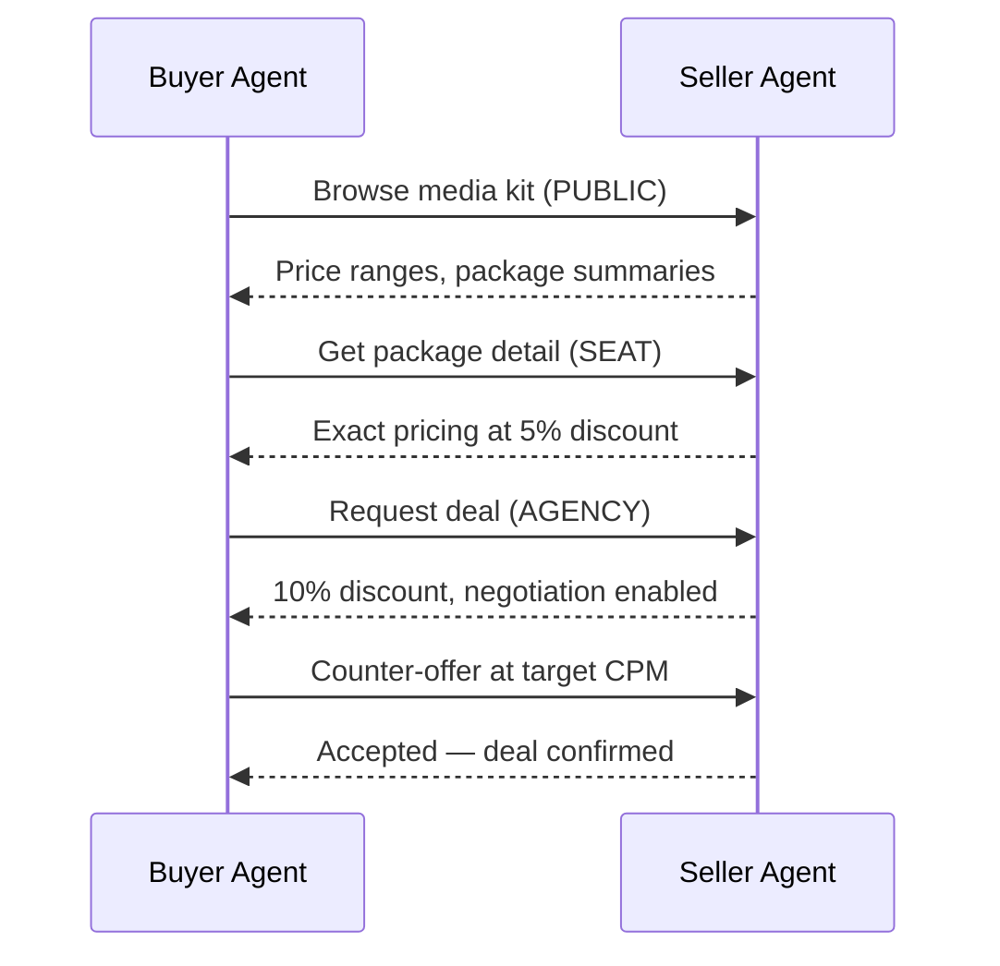

# Identity & Access Tiers

Identity is the buyer's most valuable negotiating asset. Every interaction with a seller involves a decision: **how much to reveal about who you are**. Revealing more unlocks better pricing and premium inventory, but exposes buyer information that sellers can use for competitive intelligence. The `BuyerIdentity` model controls this tradeoff: the fields you populate determine the access tier a seller grants you.

## Why Identity Matters

Seller pricing is not one-size-fits-all. Sellers apply tiered discounts based on how much they know about the buyer:

- **Anonymous buyers** see price ranges only --- no exact pricing, no negotiation.
- **Known DSP seats** get fixed pricing with a modest discount.
- **Agencies** unlock negotiation and deeper discounts.
- **Advertisers** get the best rates, volume discounts, and full inventory access.

The identity system decides which tier to present for each deal, balancing savings against information disclosure.

## Access Tiers

Four tiers control what the buyer reveals and what they receive in return:

| Tier | Identity Revealed | Discount | Negotiation | Inventory Access |
|------|-------------------|----------|-------------|------------------|
| **PUBLIC** | Nothing | 0% | No | Price ranges only |
| **SEAT** | DSP seat ID and name | 5% | No | Exact pricing |
| **AGENCY** | Seat + agency name, ID, holding company | 10% | Yes | Exact pricing + premium |
| **ADVERTISER** | Seat + agency + advertiser name, ID, industry | 15% | Yes | Full access + volume discounts |

### PUBLIC

The buyer is anonymous. The seller returns price ranges (e.g., "$28--$42 CPM") but no exact pricing, no placement details, and no negotiation. Useful for initial inventory browsing without exposing any information.

### SEAT

The buyer reveals its DSP seat identifier (e.g., `ttd-seat-123`). The seller returns exact pricing with a 5% discount. Negotiation is not available --- the buyer accepts posted prices. This is the minimum tier for transacting.

### AGENCY

The buyer additionally reveals its agency identity (name, ID, holding company). The seller applies a 10% discount and enables negotiation. Agency-tier buyers can also access premium inventory that is hidden from lower tiers.

### ADVERTISER

The buyer reveals full identity including the advertiser (name, ID, industry vertical). The seller applies the maximum 15% discount, enables negotiation, and may offer volume discounts. This tier is required for Programmatic Guaranteed (PG) deals.

!!! info "Tier is determined by fields, not by request"
    The `BuyerIdentity` model determines its tier automatically based on which fields are populated. If `advertiser_id` is set, the tier is ADVERTISER regardless of other fields.

## Choosing a Tier

Tier selection is a decision you make per seller and per deal, by constructing a `BuyerIdentity` with only the fields you want to reveal:

```python
from ad_buyer.models.buyer_identity import BuyerIdentity

# SEAT tier — reveal only the DSP seat
seat_identity = BuyerIdentity(
    seat_id="ttd-seat-123",
    seat_name="The Trade Desk",
)

# ADVERTISER tier — reveal everything for maximum discount
full_identity = BuyerIdentity(
    seat_id="ttd-seat-123",
    seat_name="The Trade Desk",
    agency_id="omnicom-456",
    agency_name="OMD",
    agency_holding_company="Omnicom",
    advertiser_id="coca-cola-789",
    advertiser_name="Coca-Cola",
    advertiser_industry="CPG",
)
```

Practical guidelines:

1. **Deal type** --- Programmatic Guaranteed requires ADVERTISER tier (guaranteed inventory needs full identity).
2. **Deal value** --- Higher-value deals justify revealing more identity for larger absolute savings.
3. **Seller relationship** --- Reveal more to trusted, established sellers; stay conservative with unknown ones.
4. **Campaign goal** --- Performance campaigns benefit from higher tiers because sellers can apply better targeting with more buyer information.

### Progressive Revelation

A typical workflow starts anonymous and escalates as the deal progresses:



## BuyerContext

`BuyerContext` is the runtime object that combines identity with session state. It wraps a `BuyerIdentity` and adds authentication status, session tracking, and deal preferences.

### Key Methods

```python
from ad_buyer.models.buyer_identity import BuyerContext, BuyerIdentity, DealType

context = BuyerContext(
    identity=BuyerIdentity(
        seat_id="ttd-seat-123",
        agency_id="omnicom-456",
    ),
    is_authenticated=True,
    preferred_deal_types=[DealType.PREFERRED_DEAL, DealType.PRIVATE_AUCTION],
)

# Check access tier (delegates to identity)
context.get_access_tier()
# -> AccessTier.AGENCY

# Check if negotiation is available (Agency and Advertiser only)
context.can_negotiate()
# -> True

# Check premium inventory access (same gate as negotiation)
context.can_access_premium_inventory()
# -> True
```

### Negotiation Eligibility

The `can_negotiate()` method is the gate that controls whether the buyer can enter price negotiation with a seller. Only AGENCY and ADVERTISER tiers return `True`:

| Tier | `can_negotiate()` | `can_access_premium_inventory()` |
|------|-------------------|----------------------------------|
| PUBLIC | `False` | `False` |
| SEAT | `False` | `False` |
| AGENCY | `True` | `True` |
| ADVERTISER | `True` | `True` |

## Identity Headers

The `BuyerIdentity` model can generate HTTP headers for direct API calls to sellers. Each identity field maps to a specific header:

```python
identity = BuyerIdentity(
    seat_id="ttd-seat-123",
    agency_id="omnicom-456",
    advertiser_id="coca-cola-789",
)

headers = identity.to_header_dict()
# {
#     "X-DSP-Seat-ID": "ttd-seat-123",
#     "X-Agency-ID": "omnicom-456",
#     "X-Advertiser-ID": "coca-cola-789",
# }
```

| Field | Header |
|-------|--------|
| `seat_id` | `X-DSP-Seat-ID` |
| `seat_name` | `X-DSP-Seat-Name` |
| `agency_id` | `X-Agency-ID` |
| `agency_name` | `X-Agency-Name` |
| `agency_holding_company` | `X-Agency-Holding-Company` |
| `advertiser_id` | `X-Advertiser-ID` |
| `advertiser_name` | `X-Advertiser-Name` |
| `advertiser_industry` | `X-Advertiser-Industry` |

Only populated fields are included. A SEAT-tier identity only produces the `X-DSP-Seat-ID` and `X-DSP-Seat-Name` headers.

## Integration with Other Systems

### Media Kit

The media kit client returns different views based on authentication and identity tier. Public requests receive `PackageSummary` objects with price ranges; authenticated requests receive `PackageDetail` objects with exact pricing, placements, and negotiation flags.

Identity context can be passed via `SearchFilter` when searching packages:

```python
from ad_buyer.media_kit.models import SearchFilter

results = await client.search_packages(
    seller_url,
    query="premium video",
    filters=SearchFilter(
        buyer_tier="advertiser",
        agency_id="omnicom-456",
        advertiser_id="coca-cola",
    ),
)
```

See [Media Kit Discovery](../api/media-kit.md) for the full API.

### Negotiation

The identity tier gates whether negotiation is available. The `can_negotiate()` check on `BuyerContext` must return `True` before the buyer can submit counter-offers or request deal modifications.

| Tier | Can Negotiate | Effect |
|------|---------------|--------|
| PUBLIC / SEAT | No | Must accept posted prices |
| AGENCY / ADVERTISER | Yes | Can submit counter-offers, request volume discounts |

See [Negotiation Guide](negotiation.md) for negotiation workflows.

### Pricing

Sellers apply tier-based discounts automatically. The discount is determined by the highest identity field present in the request.

For details on how sellers configure pricing tiers, see the [Seller Pricing Rules](https://iabtechlab.github.io/seller-agent/guides/pricing-rules/).

## Configuration

### Setting Up Buyer Identity

Identity fields are typically configured per campaign or per organization:

```python
from ad_buyer.models.buyer_identity import BuyerIdentity

# Organization-level identity (reused across campaigns)
org_identity = BuyerIdentity(
    seat_id="ttd-seat-123",
    seat_name="The Trade Desk",
    agency_id="omnicom-456",
    agency_name="OMD",
    agency_holding_company="Omnicom",
)

# Campaign-level identity (adds advertiser for specific campaigns)
campaign_identity = BuyerIdentity(
    seat_id="ttd-seat-123",
    seat_name="The Trade Desk",
    agency_id="omnicom-456",
    agency_name="OMD",
    agency_holding_company="Omnicom",
    advertiser_id="coca-cola-789",
    advertiser_name="Coca-Cola",
    advertiser_industry="CPG",
)
```

### API Key Storage

Seller API keys are managed by the `ApiKeyStore`, which persists keys per seller URL in `~/.ad_buyer/seller_keys.json`. Keys are base64-encoded on disk to prevent accidental exposure in casual file reads.

```python
from ad_buyer.auth.key_store import ApiKeyStore

store = ApiKeyStore()

# Store a key for a seller
store.add_key("http://seller.example.com:8001", "my-api-key")

# Retrieve it
key = store.get_key("http://seller.example.com:8001")

# Rotate a key
store.rotate_key("http://seller.example.com:8001", "new-api-key")

# List all sellers with stored keys
sellers = store.list_sellers()
```

!!! warning "Not encryption"
    The key store uses base64 encoding, not encryption. For production deployments, back the store with a secrets manager or encrypted file system.

## Related

- [Authentication](../api/authentication.md) --- API key setup for authenticating requests
- [Media Kit Discovery](../api/media-kit.md) --- how tiers affect inventory access and pricing
- [Negotiation Guide](negotiation.md) --- negotiation workflows and tier requirements
- [Seller Pricing Rules](https://iabtechlab.github.io/seller-agent/guides/pricing-rules/) --- how sellers configure tier-based discounts
