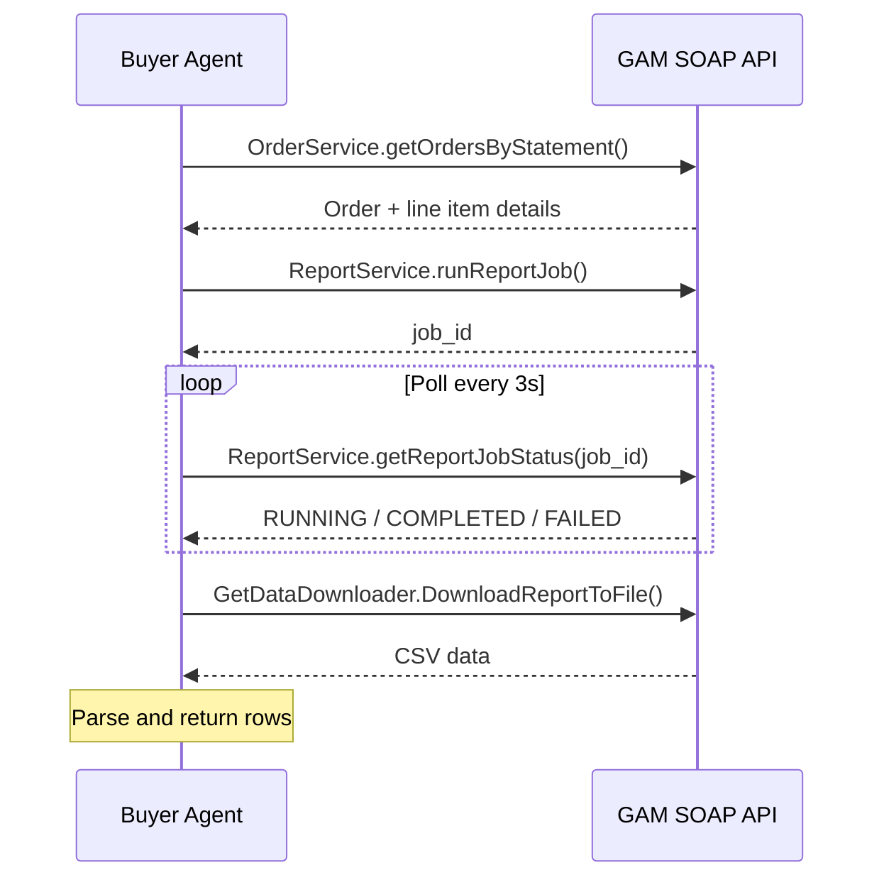

# Google Ad Manager Reporting

The buyer agent connects to Google Ad Manager (GAM) to pull delivery reports for orders booked through the IAB OpenDirect seller agent. This page covers authentication, setup steps, and the available reporting endpoints.

The buyer agent uses the GAM SOAP API via the `googleads` Python library. This means the `admanager.googleapis.com` Cloud REST API does not need to be enabled — the SOAP endpoint authenticates directly with a Google service account.

## Configuration

| Variable | Type | Default | Description |
|---|---|---|---|
| `GAM_ENABLED` | `bool` | `false` | Enable GAM reporting |
| `GAM_NETWORK_CODE` | `str` | `""` | Numeric GAM network code |
| `GAM_JSON_KEY_PATH` | `str` | `""` | Path to service account JSON key file |
| `GAM_APPLICATION_NAME` | `str` | `AAMPBuyerAgent` | Application name sent in API requests |
| `GAM_API_VERSION` | `str` | `v202505` | GAM SOAP API version |

!!! warning "Supported API versions"
    `v202411` is retired. Use `v202505` or later. Supported versions: `v202505`, `v202508`, `v202511`, `v202602`.

Add these to your `.env` file:

```bash
GAM_ENABLED=true
GAM_NETWORK_CODE=your-network-code
GAM_JSON_KEY_PATH=/path/to/gam.json
GAM_API_VERSION=v202505
```

### Installation

```bash
pip install -e ".[gam]"
```

---

## Setup

### 1. Create a Service Account

1. Go to [console.cloud.google.com](https://console.cloud.google.com) and create or select a project
2. Go to **IAM & Admin → Service Accounts → Create**
3. Download the JSON key file and save it to a secure path (e.g. `gam.json`)

### 2. Add the Service Account to GAM

1. Sign into [admanager.google.com](https://admanager.google.com)
2. Go to **Admin → Access & Authorization → API access**
3. Add the service account email (found in the JSON key file under `client_email`)
4. Grant **Read** role — sufficient for reporting

### 3. Find Your Network Code

The network code is in the GAM URL when signed in:

```
https://admanager.google.com/{NETWORK_CODE}#home
```

Or retrieve it programmatically after connecting the service account:

```python
from googleads import ad_manager, oauth2

oauth2_client = oauth2.GoogleServiceAccountClient(
    "gam.json", oauth2.GetAPIScope("ad_manager")
)
client = ad_manager.AdManagerClient(oauth2_client, "MyApp")
network_service = client.GetService("NetworkService", version="v202505")
network = network_service.getCurrentNetwork()
print(network.networkCode)
```

---

## Reporting Endpoints

### List Orders

Returns orders from the GAM network — no booking job ID required.

```
GET /gam/orders?limit=10
```

| Parameter | Type | Default | Description |
|---|---|---|---|
| `limit` | `int` | `10` | Number of orders to return |

```json
{
  "network": {
    "network_code": "XXXXXXXX",
    "display_name": "Your Publisher Network",
    "currency": "USD",
    "timezone": "America/New_York"
  },
  "orders": [
    { "id": "54058762", "name": "Q3 Display Campaign", "status": "APPROVED" },
    { "id": "54058883", "name": "Video Pre-Roll August", "status": "APPROVED" }
  ],
  "count": 10
}
```

### Delivery Report

Pulls order metadata, line items, and delivery rows for one or more GAM order IDs.

```
GET /gam/report?order_ids=ORDER_ID_1,ORDER_ID_2&days=30
```

| Parameter | Type | Default | Description |
|---|---|---|---|
| `order_ids` | `string` | required | Comma-separated numeric GAM order IDs |
| `days` | `int` | `30` | Look-back window in days |

```json
{
  "orders": [
    {
      "order_id":   "54058762",
      "order_name": "Q3 Display Campaign",
      "status":     "APPROVED",
      "line_items": [
        {
          "id":               "1195282",
          "name":             "Homepage Banner 728x90",
          "status":           "DELIVERING",
          "impressions_goal": 500000,
          "cost_type":        "CPM"
        }
      ]
    }
  ],
  "report_rows": [
    {
      "order_id":       "54058762",
      "order_name":     "Q3 Display Campaign",
      "line_item_id":   "1195282",
      "line_item_name": "Homepage Banner 728x90",
      "impressions":    142300,
      "clicks":         284,
      "revenue_usd":    1423.0
    }
  ],
  "summary": {
    "impressions": 142300,
    "clicks":      284,
    "revenue_usd": 1423.0
  }
}
```

### Job-Scoped Report

To report on IAB OpenDirect orders booked within a specific booking job:

```
GET /reports/{job_id}?date_range=last_30d
```

The buyer agent automatically identifies IAB order IDs (format `ORD-xxxx`) from `booked_lines` and routes them to GAM reporting. Meta campaign IDs from the same job are routed to Meta reporting in the same response. See [Bookings API](../api/bookings.md) for details.

---

## How Report Jobs Work

The buyer agent submits a report job to GAM's `ReportService` and polls until it completes before returning the response:



Report dimensions returned: `ORDER_ID`, `ORDER_NAME`, `LINE_ITEM_ID`, `LINE_ITEM_NAME`

Report metrics returned: `AD_SERVER_IMPRESSIONS`, `AD_SERVER_CLICKS`, `AD_SERVER_CPM_AND_CPC_REVENUE`

---

## Related

- [Meta Ads Integration](meta-ads.md) --- Book and report on social channel campaigns
- [Bookings API](../api/bookings.md) --- Full booking flow reference
- [Configuration Reference](../guides/configuration.md) --- All environment variables
- [Seller Agent Documentation](https://iabtechlab.github.io/seller-agent/) --- GAM order creation on the seller side
