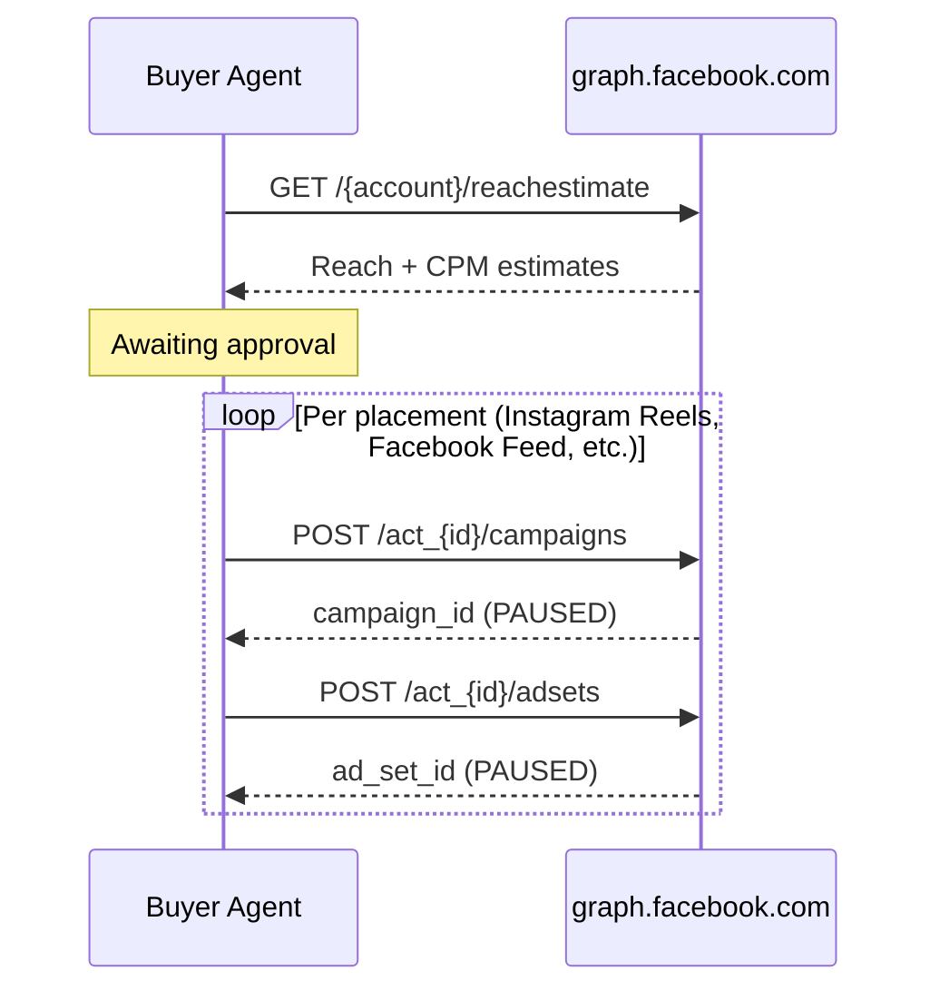

# Meta Ads Integration

The buyer agent integrates with the Meta Marketing API to book and report on social channel campaigns across Facebook and Instagram. This page covers authentication setup, the booking flow, and reporting endpoints.

The buyer agent calls `graph.facebook.com` directly using a system user access token. This is the same endpoint used by the official Meta Marketing API SDKs — no browser OAuth is required.

## Configuration

| Variable | Type | Default | Description |
|---|---|---|---|
| `META_ACCESS_TOKEN` | `str` | `""` | System user access token from Meta Business Manager |
| `META_AD_ACCOUNT_ID` | `str` | `""` | Ad account ID — format `act_XXXXXXXXX` |
| `META_PAGE_ID` | `str` | `""` | Facebook Page ID — required for ad creative creation |
| `META_API_VERSION` | `str` | `v21.0` | Meta Graph API version |

Add these to your `.env` file:

```bash
META_ACCESS_TOKEN=your-system-user-token
META_AD_ACCOUNT_ID=act_XXXXXXXXX
META_PAGE_ID=XXXXXXXXX
META_API_VERSION=v21.0
```

### Generating a System User Token

1. Open **Meta Business Manager → Business Settings → System Users**
2. Create or select a system user
3. Click **Generate Token** → select your app
4. Required scopes: `ads_management`, `ads_read`, `business_management`
5. Assign the system user to your ad account: **Business Settings → System Users → Add Assets → Ad Accounts**

### Installation

```bash
pip install -e ".[meta]"
```

!!! note "Sandbox accounts"
    Meta provides sandbox ad accounts for development. Campaigns created in a sandbox account are API-only and not visible in the Ads Manager UI. They are created in `PAUSED` state and never serve impressions.

---

## Booking Flow

When a booking brief includes `"channels": ["social"]` or `"channels": ["meta"]`, the buyer agent routes through the Meta booking path.



### Research Phase

The `SocialCrew` uses `MetaInventoryTool` to call `GET /{account}/reachestimate` and estimate reach and CPM for four placements:

- Instagram Reels
- Facebook Video Feeds
- Instagram Feed
- Facebook Feed

If the reach estimate API returns an error, the tool falls back to static estimates.

### Booking Phase

After the user approves recommendations, the buyer agent creates two resources per placement:

| Step | API Call | Status |
|---|---|---|
| 1 | `POST /act_{id}/campaigns` | PAUSED |
| 2 | `POST /act_{id}/adsets` | PAUSED |

!!! note "Creative step"
    Ad creative creation (step 3) requires an uploaded image asset. This step is skipped — campaign and ad set creation is sufficient to confirm booking.

### Objective Mapping

| IAB Objective | Meta Objective |
|---|---|
| `brand_awareness`, `reach` | `OUTCOME_AWARENESS` |
| `traffic` | `OUTCOME_TRAFFIC` |
| `conversions` | `OUTCOME_SALES` |
| `video_views` | `OUTCOME_ENGAGEMENT` |
| `lead_generation` | `OUTCOME_LEADS` |

### Budget Allocation

The `PortfolioCrew` LLM allocates budget across channels based on campaign objectives, audience fit, and KPIs. If `channels` is specified in the brief, the LLM is instructed to allocate only to those channels:

```json
{
  "channels": ["branding", "ctv", "social"],
  "budget": 15000
}
```

The LLM will distribute the `$15,000` across `branding`, `ctv`, and `social` based on which best fits the campaign objectives.

### Example Booking Request

```
POST /bookings
Content-Type: application/json
```

```json
{
  "brief": {
    "name": "Summer Campaign 2026",
    "objectives": ["brand_awareness", "reach"],
    "budget": 5000,
    "start_date": "2026-06-01",
    "end_date": "2026-06-30",
    "channels": ["social"],
    "target_audience": {
      "demographics": {"age": "18-45"},
      "interests": ["technology", "gaming"]
    }
  },
  "auto_approve": false
}
```

Poll `GET /bookings/{job_id}` until `status: awaiting_approval`, then approve:

```
POST /bookings/{job_id}/approve-all
```

Booked lines for the social channel will have `booking_status: "paused"`.

---

## Reporting

### List Campaigns

Returns all campaigns in the ad account — no booking job ID required.

```
GET /meta/campaigns?limit=10
```

| Parameter | Type | Default | Description |
|---|---|---|---|
| `limit` | `int` | `10` | Number of campaigns to return |

```json
{
  "ad_account_id": "act_XXXXXXXXX",
  "campaigns": [
    {
      "id": "23856xxxxxxxxx",
      "name": "Summer Campaign 2026 — Instagram Reels",
      "effective_status": "PAUSED",
      "objective": "OUTCOME_AWARENESS",
      "daily_budget": "125000",
      "created_time": "2026-05-11T15:35:59+0530"
    }
  ],
  "count": 10
}
```

### Campaign Report

Returns campaign details combined with delivery insights for one or more campaign IDs.

```
GET /meta/report?campaign_ids=CAMPAIGN_ID_1,CAMPAIGN_ID_2&date_preset=last_30d
```

| Parameter | Type | Default | Description |
|---|---|---|---|
| `campaign_ids` | `string` | required | Comma-separated Meta campaign IDs |
| `date_preset` | `string` | `last_30d` | `last_7d` / `last_14d` / `last_30d` / `last_90d` |

```json
{
  "ad_account_id": "act_XXXXXXXXX",
  "date_preset": "last_30d",
  "campaigns": [
    {
      "campaign_id":   "23856xxxxxxxxx",
      "campaign_name": "Summer Campaign 2026 — Instagram Reels",
      "status":        "PAUSED",
      "objective":     "OUTCOME_AWARENESS",
      "daily_budget":  "125000",
      "created_time":  "2026-05-11T15:35:59+0530",
      "spend":         0.0,
      "impressions":   0,
      "reach":         0,
      "frequency":     0.0,
      "clicks":        0,
      "ctr":           0.0,
      "cpm":           0.0
    }
  ],
  "summary": {
    "total_spend": 0.0,
    "total_impressions": 0,
    "total_clicks": 0,
    "total_reach": 0
  }
}
```

### Job-Scoped Report

To report on all campaigns booked within a specific job:

```
GET /reports/{job_id}?date_range=last_30d
```

The buyer agent automatically identifies Meta campaign IDs from `booked_lines` and pulls insights for each. IAB OpenDirect order IDs in the same job are routed to GAM reporting. See [Bookings API](../api/bookings.md) for details.

!!! tip "Access token security"
    The Meta access token is never exposed in API error responses. It is automatically redacted to `***` before any error message reaches the HTTP response.

---

## Related

- [GAM Reporting](gam-reporting.md) --- Pull delivery data from Google Ad Manager
- [Bookings API](../api/bookings.md) --- Full booking flow reference
- [Configuration Reference](../guides/configuration.md) --- All environment variables
