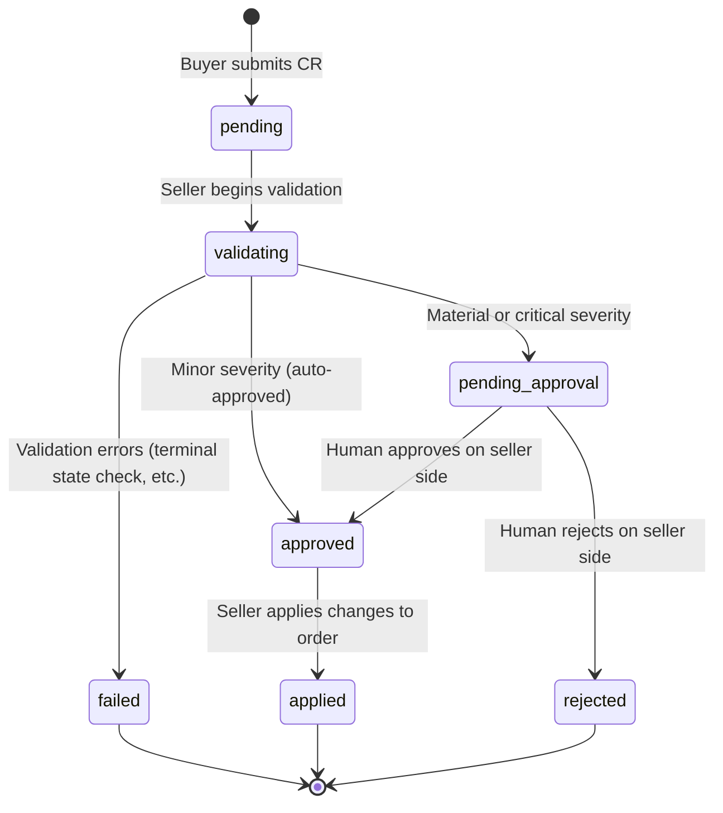
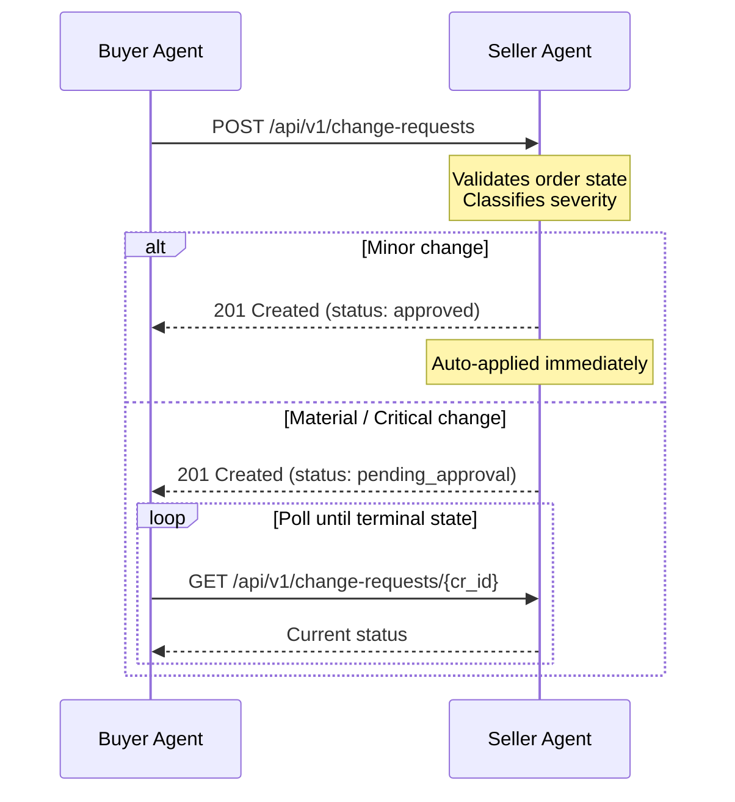

# Change Request Flow

Change requests allow the buyer to propose post-deal modifications to existing orders. The buyer submits a change request to the seller; the seller validates, classifies, and routes it through its approval pipeline.

!!! info "Seller-side definition"
    The change request state machine is enforced server-side. For the full definition --- including severity classification rules, validation logic, and the apply/rollback workflow --- see the [Seller Change Request Flow](https://iabtechlab.github.io/seller-agent/state-machines/change-request-flow/).

---

## State Diagram

---

## Statuses

| Status | Description | Who Moves To This |
|--------|-------------|-------------------|
| `pending` | CR submitted by buyer, awaiting validation | Buyer (on submit) |
| `validating` | Seller is running validation checks | Seller (automatic) |
| `pending_approval` | Passed validation; awaiting human review | Seller (material/critical) |
| `approved` | Approved for application | Seller (auto for minor; human for material/critical) |
| `rejected` | Rejected by seller reviewer | Seller reviewer |
| `failed` | Validation failed | Seller (automatic) |
| `applied` | Changes applied to the order | Seller (after approval) |

---

## Buyer Interaction Pattern

From the buyer's perspective, the flow has two parts: submit and poll.

The buyer submits the CR and receives a `change_request_id`. Minor changes return `approved` immediately and are applied without further action. Material and critical changes return `pending_approval`; the buyer polls until the status reaches a terminal state (`applied`, `rejected`, or `failed`).

---

## Guard Conditions

The seller enforces these guards before accepting a change request:

| Guard | Rule |
|-------|------|
| Terminal state | Cannot modify orders in `completed`, `cancelled`, or `failed` status |
| Cancellation eligibility | Cancellation requests only accepted from active order states: `draft`, `submitted`, `pending_approval`, `approved`, `in_progress`, `booked` |
| Impression positivity | Impression changes must result in a positive integer |

Validation failures set the CR status to `failed` and return HTTP 422. The buyer receives the error list in the response body.

---

## Severity and Approval Routing

The seller classifies each CR into one of three severity levels. Severity determines the approval path.

| Severity | Path | Buyer action |
|----------|------|--------------|
| `minor` | Auto-approved | None; CR is applied immediately |
| `material` | Human review | Poll for status update |
| `critical` | Senior review | Poll for status update |

### Default severity by change type

| Change Type | Default Severity | Notes |
|-------------|-----------------|-------|
| `creative` | `minor` | Always auto-approved |
| `flight_dates` | `material` | Downgraded to `minor` if date shift ≤ 3 days |
| `impressions` | `material` | |
| `targeting` | `material` | |
| `pricing` | `critical` | Always critical |
| `cancellation` | `critical` | Always critical |
| `other` | `material` | |

---

## Change Request Fields

The buyer provides these fields when submitting a CR:

| Field | Type | Description |
|-------|------|-------------|
| `order_id` | string | The order to modify |
| `deal_id` | string | Associated deal ID |
| `change_type` | string | Category of change (`creative`, `flight_dates`, `impressions`, `targeting`, `pricing`, `cancellation`, `other`) |
| `reason` | string | Explanation for the change |
| `proposed_values` | dict | Key-value pairs of the new values |
| `requested_by` | string | Buyer identifier |

The seller assigns `change_request_id`, `status`, `severity`, and timestamps.

---

## Related

- [Change Requests API](../api/change-requests.md) --- Request/response format, endpoints, and example payloads
- [Order State Machine](order-lifecycle.md) --- The order lifecycle that change requests modify
- [Seller Change Request Flow](https://iabtechlab.github.io/seller-agent/state-machines/change-request-flow/) --- Authoritative seller-side state machine definition
